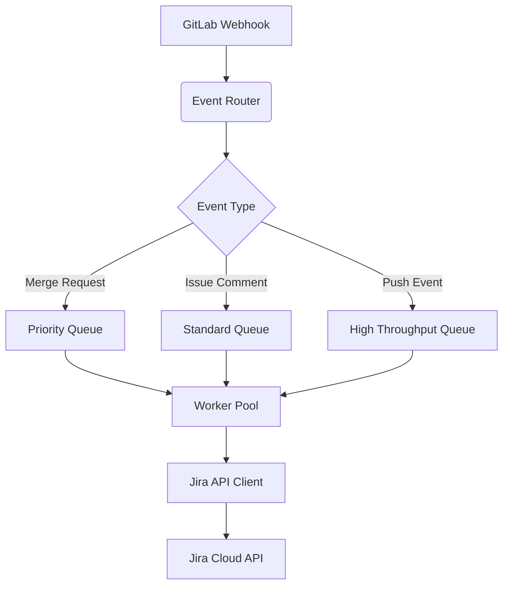

# Architecture Overview

## Core Components
The GitLab ↔ Jira Hook architecture consists of several core components that work together to provide seamless integration between GitLab and Jira:

1. **Event Router**: Processes incoming GitLab events and routes them to appropriate handlers
2. **Jira API Client**: Manages all communication with Jira Cloud REST API v3
3. **Worker Pool**: Handles async processing of events with configurable scaling
4. **Configuration Manager**: Manages dynamic configuration loading and hot-reloading
5. **Error Handler**: Implements circuit breaker patterns and recovery strategies

## Async Processing Architecture
The async processing system follows a priority-based worker pool pattern:

### Key Features
- **Dynamic Worker Scaling**: Automatically adjusts worker count based on queue depth
- **Priority-based Processing**: Critical events (like merge requests) are processed first
- **Batch Processing**: Groups similar events for efficient Jira API calls
- **Circuit Breaker**: Prevents cascading failures during Jira API outages

## Error Handling Strategy
The system implements a multi-layer error handling approach:

1. **Event-level Error Handling**:
   - Automatic retries with exponential backoff
   - Dead-letter queue for persistent failures
   - Error classification (transient vs. permanent)

2. **API-level Error Handling**:
   - Rate limit awareness and backoff
   - Token refresh handling for expired credentials
   - Jira API version compatibility layer

3. **System-level Error Handling**:
   - Circuit breaker patterns for external dependencies
   - Graceful degradation when Jira is unavailable
   - Comprehensive error metrics collection

## Monitoring and Observability
The system provides multiple monitoring capabilities:

- **Metrics**:
  - Event processing latency
  - Queue depth metrics
  - API error rates
  - Worker utilization

- **Tracing**:
  - Full request tracing with OpenTelemetry
  - Distributed tracing across GitLab and Jira events
  - Span context propagation between services

- **Health Checks**:
  - Liveness/readiness endpoints
  - Dependency health verification
  - Configuration validation endpoint

## Configuration Management
The system supports dynamic configuration through:

- **Hot-reloading**:
  - File system watching for config changes
  - Zero-downtime configuration updates
  - Validation before applying changes

- **Environment Variables**:
  - Overriding configuration values
  - Secrets management integration
  - Fallback to default values

- **Config Validation**:
  - Schema validation on startup
  - Type-safe configuration with Go 1.24 generics
  - Example: `type Config[T any] struct { ... }`

## Next Steps
1. Create detailed async processing documentation
2. Document error handling implementation details
3. Add monitoring configuration examples
4. Implement configuration hot-reloading guide
