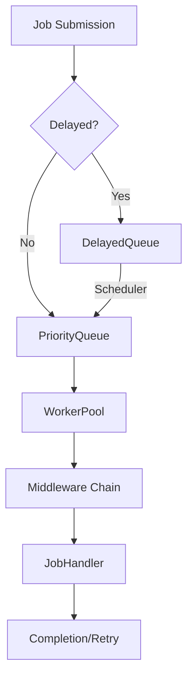

# Async Job Broker, Scheduler, and Queue: Architecture & Lifecycle

## Overview

This document describes the architecture of the async job broker, scheduler, queue, and request processing in the `gitlab-jira-hook` system. It covers the main components, their interactions, job lifecycle, and implementation recommendations.

---

## 1. Core Components

- **PriorityWorkerPool** — worker pool with dynamic scaling and priority support.
- **PriorityQueue** — priority queue for jobs.
- **DelayedQueue** — delayed job queue with scheduler.
- **Scheduler** — scheduler that periodically moves jobs from DelayedQueue to PriorityQueue.
- **Job** — unit of work (event processing, webhook handling, etc.).
- **PriorityDecider** — interface for determining job priority.
- **Middleware** — middleware chain for logging, retries, timeouts, and more.

---

## 2. Job Lifecycle

---

## 3. Component Interactions

- **Job Submission:**
  - Jobs are submitted via SubmitJob or SubmitDelayedJob.
  - Priority is determined via PriorityDecider if needed.
- **DelayedQueue:**
  - Stores delayed jobs until execution time.
  - Scheduler runs every 5–100ms and moves ready jobs to PriorityQueue.
- **PriorityQueue:**
  - Stores jobs with priority consideration.
  - Returns error on overflow (backpressure).
- **WorkerPool:**
  - Dynamically scales between MinWorkers and MaxWorkers.
  - Each worker takes a job from PriorityQueue and processes it through middleware chain.
- **Middleware:**
  - Logging, retry, timeouts, circuit breaker, etc.
- **Graceful Shutdown:**
  - All queues and workers properly terminate on shutdown.

---

## 4. Implementation Principles

- **Dynamic Scaling:**
  - Monitor queue length and load, automatically add/remove workers.
- **Priorities:**
  - High-priority jobs are processed first.
- **Delayed Jobs:**
  - Precise timing, minimal scheduler delay.
- **Backpressure:**
  - New jobs are rejected when queue is full.
- **Retry/Backoff:**
  - Errors are handled with exponential delay and retry limits.
- **Observability:**
  - Metrics: queue length, worker count, average job time, errors.
- **Safety:**
  - Memory control, timeouts, deadlock protection.

---

## 5. Configuration Example

See [broker_formula.md](broker_formula.md) and [README.md](../README.md)

---

## 6. Recommendations
- Use auto-detect for W and Q if unsure about parameters.
- For high load, increase Q and W, but monitor memory.
- For minimal latency, decrease Q, increase W.
- Always monitor metrics and profile the system under real load.

---

## 7. References
- [broker_formula.md](broker_formula.md) — formulas and parameters
- [api/openapi.yaml](api/openapi.yaml) — API documentation
- [README.md](../README.md) — project overview 